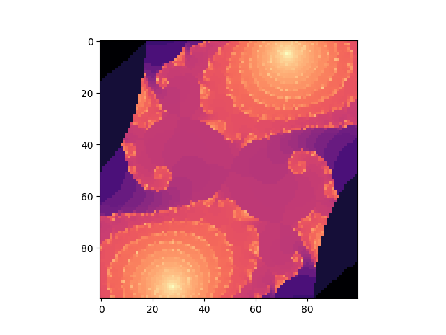

## Introductory Exercises
Thank you for taking the course. Completing the following tasks will prepare you for the practical assignments of this course. Machine learning on larger scales often requires using central compute clusters, which run on Linux. Consequently, we will assume workstations running Ubuntu Linux. Most of the exercises also work on Windows with adjusted commands. In order to make working with Python easier, we recommend installing Visual Studio Code (or other API).

### Task 1: Downloading and installing Miniconda.
To develop and execute our python code, we use a python container software called miniconda. Using miniconda you can create an `environment` which holds python and all the required software to run the given scripts.
- Navigate to https://docs.conda.io/en/latest/miniconda.html in your favorite browser. Download the `Miniconda3 Linux 64-bit` file.

- Open the terminal on your machine by pressing `Ctrl+Alt+T`. Navigate into the Downloads folder by typing `cd Downloads`. Before running the installer, set the executable bit by typing `chmod +x Miniconda3-latest-Linux-x86_64.sh`. Install Miniconda via `./Miniconda3-latest-Linux-x86_64.sh`.
- Close your terminal and open it again. Check if you can see the `(base)` environment name on the left hand side of your command line. This means that (mini)conda is installed correctly.


### Task 2: Setting up VSCode for python development
- Open Visual Studio Code. In VSCode, you can open a rendered version of this readme. Right-click the file and select `open Preview`.
- Click on the extensions tab in VSCode (on the left hand side) or press `Ctrl+Shift+X`. Install the `Python` and `Remote-SSH` extensions. Choose the versions provided by Microsoft.
- Make the Miniconda interpreter your default in VSCode by pressing `Ctrl+Shift+P`. Type `select interpreter` and press enter. In the following dialogue, choose the `base` environment. 

### Task 3: Installing dependencies
- Open a terminal by pressing `Ctrl+Alt+T`. Navigate into this directory by typing `cd path_to_this_folder`. Type

  ```bash
  pip install -r requirements.txt
  ```
  to install the python packages required for this exercise.

### Task 4: Run an automatic test.
Scientific software must provide reproducible results. Automatic testing ensures our software runs reliably. We recommend Nox for test automation https://nox.thea.codes/en/stable/. 
- To run some of the tests we prepared for you type,
    ```bash
    nox -s test
    ```
  The python extension provides test integration into VSCode. To use it, click on the lab-flask icon on the left sidebar. When opening it for the first time, it asks you for a configuration.
  Click the `Configure Python Tests` button and select `pytest` in the ensuing prompt. In the next step, VSCode wants to know the location of the test folder. Choose `tests`. 
  VSCode will now display your tests on the sidebar on the left. Click the play symbol next to the tests folder to run all tests.

### Task 5: Implement and test a python class.
- Open `src/my_code.py` and finish the `__init__` function of the `Complex` class. The idea here is to implement support for complex numbers (see: https://en.wikipedia.org/wiki/Complex_number for more information about complex numbers). Double-check your code by running `nox -s test`. 

### Task 6: Breakpoints
- Click on a line number in `my_code.py`. A red dot appears. Press the `debug_test` button in the `Testing` tab, Python will pause, and you can use the build-in `Debug console` to explore the data at this point.

### Task 7: Implement the remaining functions in my_code.py
- Implement and test the `add`, `radius`, `angle`, and `multiply` functions.

### Task 8: Plotting
- Run `python ./src/julia.py` to compute a plot of the Julia set with your `Complex` class (see: https://en.wikipedia.org/wiki/Julia_set for more information).
- In `src/julia.py` use `plt.plot` and `plt.imshow` to visualize the julia-set. Feel free to play with `c` to create different sets.

### Solution 


### Task 9: Getting nox to help you format your code.
- Professionally written python code respects coding conventions. Type `nox -s format` to have `nox` format your code for you.

### Optional Task 10: Linting
- `nox` can do even more for you! A basic syntax error at the wrong place can cost days of computation time. Type
  ```bash
  nox -s lint
  ```
  to check your code for formatting issues and syntax errors.

### Optional Task 11: Typing
- Take a look at https://docs.python.org/3/library/typing.html . `nox` can help you by checking your code for type problems and incorrect function signatures.
  ```bash
  nox -s typing
  ```


