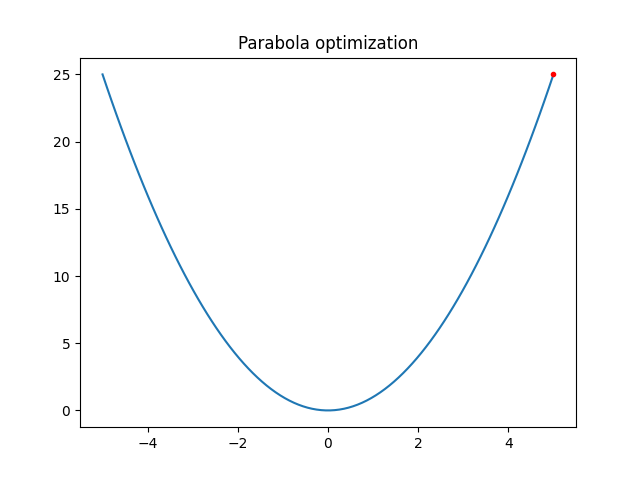

# Optimization Exercise
During this exercise, you will implement gradient descent to solve optimization problems.
For all activities, the task is to find the lowest point on a function surface or in 
mathematical language 

$$ \min_{x}f(x) .$$

All modules in `src` require your attention. 
- To get started, take a look at `src/optimize_1d.py`.
Use the gradient to find the minumum of the parabola starting from five, or in other words

$$ \min_{x} x^2,  \text{   with   } x_0 = 5 .$$

The problem is illustrated below:

- Next we consider a paraboloid, $\cdot$ denotes the scalar product,

$$ \min_{\mathbf{x}} \mathbf{x} \cdot \mathbf{x},  \text{   with   } \mathbf{x_0} = (2.9, -2.9) .$$

The paraboloid is already implemented in `src/optimize_2d.py`. 
Your task is to solve this problem using two-dimensional gradient descent.
Once more the problem is illustrated below:

- Additionally we consider a bumpy paraboloid, $\cdot$ denotes the scalar product,

$$ \min_{\mathbf{x}} \mathbf{x} \cdot \mathbf{x} + \cos(2  \pi x_0) + \sin(2 \pi x_1 ), \text{   with   } \mathbf{x_0} = (2.9, -2.9) .$$

The addtional sin and cosine terms will require momentum for convergence.
The bumpy paraboloid is already implemented in `src/optimize_2d_momentum_bumpy.py`. 
Your task is to solve this problem using two-dimensional gradient descent with momentum.
Once more the problem is illustrated below:

- Finally, to explore the automatic differentiation functionality we consider the problem,

$$ \min_{\mathbf{x}} \mathbf{x} \cdot \mathbf{x} + \cos(2 \pi x_0 ) + \sin(2 \pi x_1)  + 0.5 \cdot \text{relu}(x_0) + 10 \cdot \tanh( \|\mathbf{x} \| ),  \text{   with   } \mathbf{x_0} = (2.9, -2.9) .$$

The function is already defined in  `src/optimize_2d_momentum_bumpy_jax.py`. We don't have to find the gradient by hand!
Use `jax.grad` [(jax-documentation)](https://jax.readthedocs.io/en/latest/_autosummary/jax.grad.html) to compute the gradient automatically. Use the result to find the minimum using momentum.  

While coding use `nox -s test`, `nox -s lint`, and `nox -s typing` to check your code.
Autoformatting help is available via `nox -s format`.
Feel free to read mode about nox at https://nox.thea.codes/en/stable/ .
